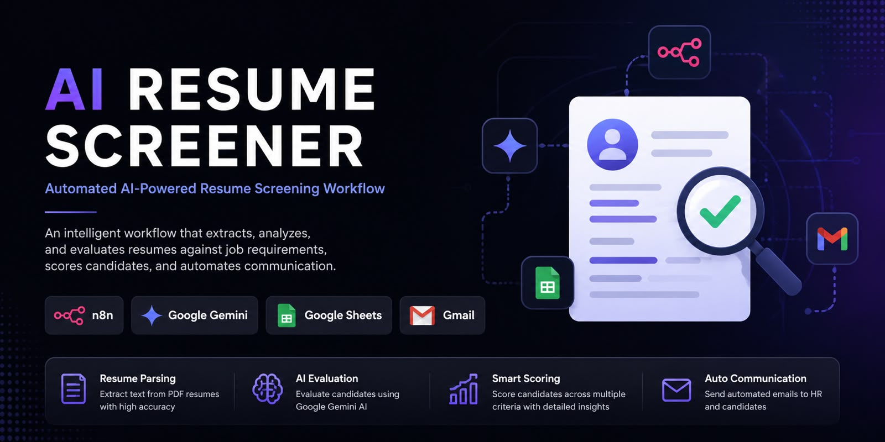
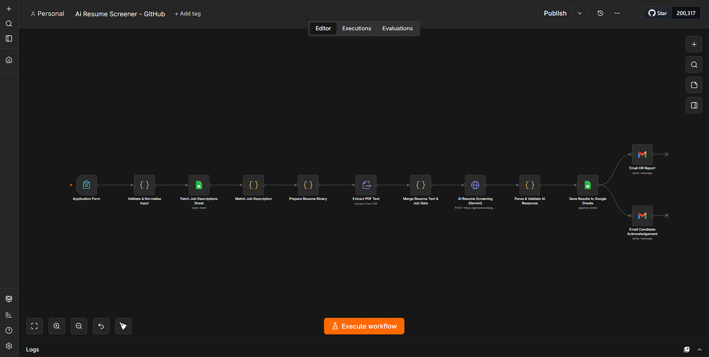

# AI Resume Screener

An AI-powered resume screening workflow built with **n8n** and **Google Gemini**.

## 🚀 Overview

This project automates the initial resume screening process. It collects candidate information and resumes, matches them against the selected job requirements, evaluates the candidate using AI, calculates an overall score, and automates the screening results.

## ✨ Features

- 📄 Resume PDF processing
- 🎯 Job description matching
- 🤖 AI-powered candidate evaluation
- 📊 Candidate scoring
- 🧠 Skills, strengths, weaknesses & missing skills analysis
- 💬 AI-generated interview questions
- 📧 Automated HR report
- 📩 Automated candidate acknowledgement
- 📋 Automatic results storage in Google Sheets

## 🛠️ Tech Stack

- n8n
- Google Gemini API
- Google Sheets
- Gmail
- ConvertAPI
- JavaScript

## 🔄 Workflow

1. Candidate submits application and resume.
2. Job requirements are retrieved from Google Sheets.
3. Resume PDF is processed and converted to text.
4. Resume data is combined with the relevant job description.
5. Google Gemini evaluates the candidate.
6. Candidate receives scores and an AI-generated assessment.
7. Screening results are stored in Google Sheets.
8. HR receives an automated report.
9. Candidate receives an acknowledgement email.

### Workflow Overview

## 📌 Project Purpose

The goal of this project is to reduce manual resume screening work and create a structured, automated workflow for initial candidate evaluation.

## 🔐 Security Note

API keys, passwords, OAuth credentials, `.env` files, and private candidate information should never be committed to this repository.

## 📂 Workflow File

The repository contains the n8n workflow JSON file that can be imported into an n8n instance.

## 👩‍💻 Built With

Built as an AI Automation project to demonstrate workflow automation, API integration, AI-based decision support, and automated communication.
